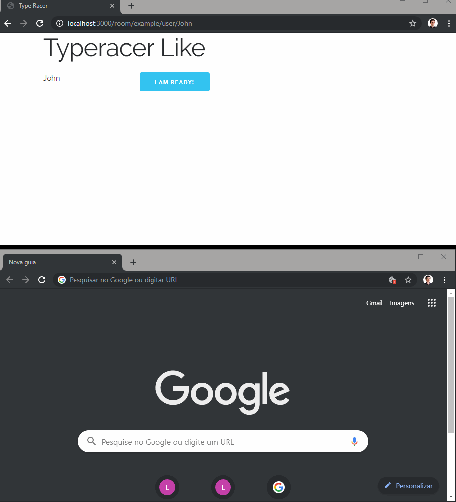

# Type Racer Clone

A simple clone of [typeracer](http://play.typeracer.com/), written in Node and React.

This was made as part of the hiring process at [pagar.me](https://pagar.me/).

## Requirements

- [Node](https://nodejs.org/en/download/)
- [Yarn](https://yarnpkg.com/lang/en/docs/install/)

## Installing

Inside the project folder, run the command:

```sh
yarn
```

## Playing

Run with `yarn start` and then open [http://localhost:3000/room/MYROOM/user/MYUSER](http://localhost:3000/room/MYROOM/user/MYUSER), where `MYROOM` is the room name and `MYUSER` is the username.

You'll need at least two users in the same room that have clicked the "ready" button for the game to start.


